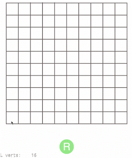

# Virus Battle Game

## Rules

Viruses is a paper-game that was popular in tech-schools in USSR.
It is played on a checkered piece of paper in the square 10 x 10.
Two players play the game. On each turn a player has three actions.
At each action the player can either make a virus or infect a virus
of the opponent, transforming it into own tower. You cannot infect
a tower of the opponent.

Below is the playgame.

The initial move for each player should be in the corner of the square.
All next moves should be done with connection (by side or angle) with an alive 
item of the player. Every virus is alive. A tower of the player is considered as 
alive it is connected with the virus of that player or another alive tower.
If there is connection between the tower and a virus (direct or indirect) tower
is considered as dead.

The player who cannot make an action looses the game.
